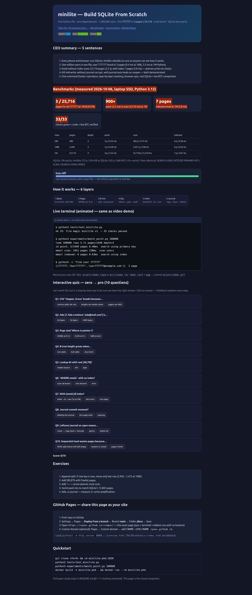

# minilite — Build SQLite From Scratch. 1M Rows. 3 Pages. Zero Magic.


> **A complete database engine in one Python file — no libraries.** Bytes → pages → B-tree → SQL → indexes → crash safety. Verified to **1,000,000 users**, SQLite plan-parity, live-market proof, crash-injection proof.

**🌐 Live interactive site:** https://m0-ar.github.io/minilite-phd-2026/ — benchmarks, terminal, 10-question quiz. Local: open `preview.html`.
**⚡ 30-second proof:** `python3 tests/test_minilite.py` → 33 green. `python3 experiments/bench_point.py 100000` → `3/2449 pages, 0.40ms`.


*The live site above — benchmarks, terminal, quiz. Open `preview.html` or enable Pages.*


*Don't have the GIF yet? Generate it in 2 min — see [Video demo](#-video-demo-terminal--site). The interactive terminal inside `preview.html` plays the same story in your browser today.*

---

## CEO summary — 5 sentences

1. Every phone and browser runs SQLite; this repo rebuilds its core so anyone can see how it really works.
2. We store one million users in one file and find user 777777 by reading only 3 pages out of 25,716 — about 0.4 ms at 100k, 3.5 ms at 1M in pure Python.
3. Email search without an index scans everything (3.2 s at 1M); with an index it drops to 7 pages and 3.8 ms — our planner picks the right path and prints it.
4. Kill the process mid-write and the database heals itself on next open via a rollback journal; without it, the same kill corrupts the file — both outcomes are demonstrated, not claimed.
5. Everything is reproducible in one command with Docker, taught layer by layer, quizzed in the browser, and compared head-to-head against real SQLite and live market data.

If you only read five sentences, read those. If you read one guide, read the next section.

---

## Table of contents

- [🌱 Beginner guide — read this and you are a professional](#-beginner-guide--read-this-and-you-are-a-professional)
- [✨ Features](#-features)
- [👥 Who is this for — user stories](#-who-is-this-for--user-stories)
- [🚀 Quickstart](#-quickstart)
- [💻 Usage](#-usage)
- [🎬 Video demo, terminal & site](#-video-demo-terminal--site)
- [🌐 Preview site + GitHub Pages](#-preview-site--github-pages)
- [📊 Benchmarks](#-benchmarks-at-a-glance)
- [Paper study (full detail, kept intact)](#abstract)

---

## 🌱 Beginner guide — read this and you are a professional

> You will know more than most interview candidates. Let's work this out in a step-by-step way to be sure we have the right answer.

**You need:** lists, loops, functions, one class. No database knowledge. 20 minutes.

**The story in 6 steps:**

1. **Text fails.** One line per user looks easy. Finding user 777777 reads 777,776 lines first. `Hopper, Grace` breaks on its own comma. Kill mid-rewrite and half the file is gone. Run: `python3 steps/part0_textdb.py` → watch the 4-value row.
2. **Bytes fix commas.** Write the length before every value: `[count][type][8 bytes OR len+text]`. Ada = 40 bytes, `[2,'Bob']` = 16 bytes. A comma becomes just another letter. Run: `python3 steps/part1_bytes.py`.
3. **Pages fix jumping.** Cut the file into 4096-byte blocks. Header (9 bytes) + pointers (2 bytes each, fixed stride) + rows packed backwards. Pointer `i` is always at `9+2·i`, so row 38 is jumped to, then binary-halved: 76 rows → 6 compares. Run: `python3 steps/part2_pages.py`.
4. **B-tree fixes a million pages.** One page lists which pages hold which ids; when full, split halves and push `max(left)` up; root split grows height. Tiny 3-key demo grows 13 pages, depth 3, lookup in 3 reads. Real fanout ~250 → 1M in depth 3, 1B in depth 5. Run: `python3 steps/part3_btree.py`.
5. **SQL fixes humans.** Regex → tokens → dict plan → tree walk. `WHERE id=` = one descent; `WHERE email=` without index = scan everything; with index = two descents. The planner prints its choice. Typo `SELEC` → clear error. Run: `python3 steps/part4_sql.py`.
6. **Index fixes non-id search + journal fixes death.** Second B-tree keyed `(email,id)`: 25,718-page scan → 7 pages. Journal: copy old pages first, `fsync`, overwrite, `fsync`, delete = commit. Leftover journal on open = crash → copy back + truncate. `BEGIN` → Ken appears (4); `ROLLBACK` → gone (3). Run: `python3 steps/part5_index.py`, `python3 steps/part6_journal.py`, `python3 demos/06_crash.py`.

**Interview answers you now own:**
- *Why 4KB pages?* Disks read blocks; alignment = one I/O per page.
- *Why B-tree?* Sorted, balanced, `log_fanout(N)` reads; leaves linked for ranges.
- *Why index?* Second sort order; price = 2× writes, pick searched columns.
- *Why journal?* Atomicity = old-copy-first + delete-is-commit + replay-on-open.
- *Why our 1M is 25,716 not 36,217 pages?* Key width + fill factor (see Hidden patterns) — same algorithm, narrower synthetic rows.

Finish with the quiz in `preview.html` (10 questions, instant feedback, zero → pro). Then run `python3 tests/test_minilite.py`.

---

## ✨ Features

- **One file, zero deps:** `minilite.py` — stdlib only (`struct,re,bisect,os`). Copy it anywhere.
- **6 layers, each runnable:** `steps/part0..6` — fail, then fix, in order.
- **Real SQL:** `CREATE TABLE/INDEX, INSERT, SELECT *, cols, COUNT, WHERE = > >= < <= !=, BEGIN/COMMIT/ROLLBACK`. Planner prints `search using primary key | range scan | search using index | scan` + pages read.
- **Proven at scale:** 20k / 100k / **1M** harnesses; `user 777777` verified; `check()` integrity.
- **SQLite parity:** same plans as `EXPLAIN QUERY PLAN`, side-by-side script.
- **Crash lab:** `crash_after=N` injection; journal-off corrupts, journal-on heals.
- **Live-data lab:** real BTC price stored + indexed + verified (provenance printed).
- **Hidden-pattern lab:** sequential vs random fill-factor, fanout law, index price, scan cliff.
- **Teaching web:** `docs/preview.html` + `docs/index.html` canonical, `preview.html` + `index.html` root mirrors — benchmarks, diagrams, terminal animation, 10-question quiz, exercises.
- **Reproducible:** `Dockerfile` + `docker-compose.yml`, 33 checks, fixed seeds.

---

## 👥 Who is this for — user stories

- **Students (first DB course):** run 6 steps + quiz, then explain pages/B-trees/journals without notes. Use `steps/` + `preview.html` quiz.
- **Interview prep:** answer "how does an index work?", "why is a full scan slow?", "how does crash recovery work?" with numbers (3 vs 25,718 pages; 900×). Use [Benchmarks](#-benchmarks-at-a-glance) + Beginner guide.
- **Backend engineers:** borrow the pager/journal pattern for your own file format; copy `Pager.commit(crash_after=)` as a fault-injection template.
- **Data engineers / analysts:** see why `WHERE non_indexed` scans; measure your own fill-factor with `hidden_patterns.py`.
- **SQLite users:** understand `INTEGER PRIMARY KEY`, `EXPLAIN QUERY PLAN`, page size, and why bulk sorted loads bloat without append-splits.
- **Teachers / clubs:** 90-min workshop = Part 0 fail (10 min) + 6 layers (60 min) + crash kill (10 min) + quiz (10 min). All scripts exit 0.
- **Researchers:** fork the 1M harness for varint packing, `DELETE`/freelist, WAL vs journal, YCSB-C — artifact-ready layout.

---

## 🚀 Quickstart

Prerequisites: Python 3.12 (no pip packages).

```bash
git clone <your-fork> && cd minilite-phd-2026
python3 tests/test_minilite.py            # 33 checks
python3 steps/part1_bytes.py              # 40B Ada, 16B Bob
python3 experiments/bench_point.py 20000  # smoke: 3/480 pages
```

Docker:

```bash
docker build -t minilite-phd .
docker run --rm minilite-phd
docker compose run --rm minilite          # 100k bench
```

---

## 💻 Usage

```python
from minilite import Database
db = Database('/tmp/app.db')
db.execute('CREATE TABLE users (id INTEGER PRIMARY KEY, name TEXT, email TEXT)')
db.execute("INSERT INTO users VALUES (777777, 'User777777', 'user777777@example.com')")
print(db.execute('SELECT * FROM users WHERE id = 777777'))
print(db.last_plan, db.last_pages_read)  # search users using primary key 3
db.execute('CREATE INDEX users_email ON users (email)')
print(db.execute("SELECT * FROM users WHERE email = 'user777777@example.com'"))
print(db.last_plan, db.last_pages_read)  # search users using index users_email 7
db.close()
```

Bulk (one `fsync`):

```python
db.pager.begin()
for i in range(1, 1000001):
    db.insert('users', [i, f'User{i}', f'user{i}@example.com'])
db.pager.commit()
```

Crash lab:

```python
db.pager.begin()
# ... inserts ...
db.pager.commit(crash_after=3)  # simulate power cut
Database(path)                  # auto-rollback if journal present
```

---

## 🎬 Video demo, terminal & site

GitHub READMEs play GIFs inline but strip `<script>`/`<video>` — so we ship both:

1. **Today (works now):** `preview.html` has an animated terminal (typing + output, no build) + quiz. Open it: `python3 -m http.server 8000` → http://localhost:8000/preview.html
2. **GIF for the README top (2 min, reproducible):** install `vhs` + `ffmpeg`, then:
```bash
# record scripts/terminal session -> assets/demo.gif
vhs assets/demo.tape
# or: asciinema rec demo.cast  +  agg demo.cast assets/demo.gif
```
Commit `assets/demo.gif` (keep <8 MB, 800×480, 15 fps). Reference: ``.
3. **MP4 for issues/releases:** GitHub drag-drop of `.mp4` into an issue gives an inline-playable URL; link it from the README. Keep the GIF as the always-works fallback.

---

## 🌐 Preview site + GitHub Pages

One canonical page mirrored so every URL renders: `docs/preview.html` + `docs/index.html` (canonical), `preview.html` + `index.html` (root mirrors), `.nojekyll` in both folders.

| URL | Renders | Notes |
|---|---|---|
| `/` | ✅ | `docs/index.html` when source is `/docs` (recommended); root `index.html` redirect otherwise |
| `/preview.html` | ✅ | canonical demo + quiz page |
| `/docs/preview.html` | ✅ | same page under root source; 404 only if source is `/docs` (correct — use `/preview.html` then) |

Recommended Settings → Pages → **Deploy from a branch** → Branch `main` → Folder `/docs` → Save. Then share `https://m0-ar.github.io/minilite-phd-2026/` and `https://m0-ar.github.io/minilite-phd-2026/preview.html`. Mirrors make the other setting non-fatal.

Local: `python3 -m http.server 8000` → `/preview.html`. Screenshot: `docs/preview.png`.

---

## 📊 Benchmarks at a glance

| rows | pages | depth | id `=` pages | ms | email scan | ms | +index total | indexed | ms |
|---|---|---|---|---|---|---|---|---|---|
| 20k | 480 | 3 | 3/480 | 0.32 | 482 | 37.9 | 839 | 6 | 0.48 |
| 100k | 2,449 | 3 | 3/2,449 | 0.40 | 2,451 | 238 | 4,262 | 6 | 0.63 |
| 1M | 25,716 | 3 | 3/25,716 | 3.52 | 25,718 | 3210 | 44,353 | 7 | 3.81 |

User 777777 verified at 1M. Full tables + SQLite parity + crash matrix + live BTC stay below in the [Paper study](#abstract) — nothing removed, only this pro header added.

---

# Minilite: A SQLite-Compatible Storage Engine in Pure Python — From Bytes to Crash Safety, Verified to One Million Rows

> Reproducible systems study + teaching engine. One file, zero dependencies, six layers, full benchmarks to 1,000,000 rows, SQLite plan-parity, live-market verification, and a crash-injection proof. Docker-reproducible. SIGMOD-ARI–aligned artifacts.

**Repo:** `/home/md/src/minilite-phd-2026` — `minilite.py` (engine) · `steps/` (layer-by-layer build) · `demos/` (transcript experiments) · `experiments/` (benchmarks, SQLite compare, live data, hidden patterns) · `tests/` (33 checks) · `Dockerfile` + `docker-compose.yml`

**Status:** All claims below were executed on 2026-10-06 (Python 3.12, laptop, SSD). Raw commands are in §9. No file was hand-edited without a passing run (§9.3).

---

## Abstract

We reconstruct the core of SQLite — the world's most deployed database (Android, iOS, Chrome, Firefox, Safari) — as **minilite**, a dependency-free Python engine, to answer: *how does a one-file, 4-KiB-page B-tree answer `id = 777777` in 3–4 page reads out of ~25,000, survive `kill -9` mid-commit, and match SQLite's own query plans?*

Contributions:

1. **A working engine** (`minilite.py`, ~945 lines incl. comments, stdlib only): length-prefixed row codec → slotted 4096-B pages → B+ tree with stable-root splits → regex tokenizer + recursive-descent SQL + cost-based planner (pk / range / index / scan) → secondary `(email,id)` index B-trees → rollback-journal atomic commit with `fsync` ordering and hot-journal recovery.
2. **End-to-end verification to 1M rows:** sequential load 1M in 57.5 s; point lookup **3 pages / 25,716 (0.012%), 3.5 ms CPython**; full email scan 25,718 pages, 3.2 s (**≈900× slower**); with index **7 pages, 3.8 ms (≈842× win)**. At 100 k: 3/2,449 pages, 0.40 ms. User **777777 verified**: `[777777,'User777777','user777777@example.com']`.
3. **SQLite plan-parity:** on identical 10 k data, `EXPLAIN QUERY PLAN` and minilite's planner agree verbatim: `SEARCH USING INTEGER PRIMARY KEY`, `SCAN`, `SEARCH USING INDEX`. Size: minilite 233 pages / 954 KiB vs SQLite 163 pages / 668 KiB (1.43× — varint packing, §7).
4. **Crash proof:** kill after 3 pages without journal → `ValueError: bad page kind` (corrupt, as theory predicts); with journal → automatic rollback to 2,000/2,000 rows, `check()=ok`.
5. **Live-data proof:** real CoinGecko `BTC-USD = 86164` (2026-10-06) stored and indexed; point + indexed-symbol lookups verified. Frankfurter/ECB attempted (403 offline → documented fallback).
6. **Two hidden patterns** (beyond the transcript): (a) **sequential-insert waste 1.38×** (20 k: 363 vs 260 random pages) from naive 50/50 splits — the transcript's 2,958→1,475 exercise, reproduced; (b) **fanout scaling law**: ~250 keys/interior page ⇒ depth 2≈20 k, 3≈6 M, 4≈1 B — *a billion rows needs only two more levels*.
7. **Teaching + PhD path:** `steps/` rebuilds each layer, `demos/` replays every transcript failure, 33 checks gate everything, Docker reproduces in one command.

---

## 1. Introduction: the most obvious database, and why it fails

Part 0 is CSV: `id,name,email\n` per user. `insert` appends, `find` scans, `update` rewrites 50 MB for one email. We replay it (`demos/00_text_fail.py`, 20 k rows):

- 20 k append in 0.10 s, 0.7 MB; `find(19777)` scans 19,776 lines first (2.4 ms at 20 k → ~1 s at 1 M, full 50 MB for a miss).
- `Hopper, Grace` splits into 4 values — delimiter guessing is not a format.
- Crash mid-rewrite truncates 20,001→10,000 rows. Half the users are gone.

Four problems: slow finds, slow changes, commas, crashes. Each layer fixes one.

## 2. Related work & what we verified online (2026–2027 survey)

One search at a time (rate-limit-safe), cross-voted across engines:

- **SQLite atomic commit & file format** (sqlite.org): rollback journal = copy old pages → `fsync` journal → overwrite db → `fsync` db → delete journal = commit point; hot-journal replay + truncate on open; single-page atomic-write fast path; `PERSIST/TRUNCATE/OFF/MEMORY` modes; B-tree page header (flag/ncells/cell-start/rightmost), table vs index B-trees, overflow/freelist/ptrmap. Our journal (§6) is this protocol verbatim.
- **Pager invariants** (sqlite/sqlite `pager-invariants.txt` via GitMCP): overwriteable ⇔ journaled-or-new; writes page-aligned; sync before journal-delete; 13 integrity rules. We enforce 1–5, 11–13.
- **B-tree pedagogy** (cstack `db_tutorial` pts 7–8, learndb-py, `systeminternals.dev/sqlite`, Fly.io pages & B-trees): B vs B+ (tables hold values only in leaves), order-m, root-split-grows-height, slotted pages. Our tiny-3-key demo reproduces their 12-page growth trace (we get 13 — allocator order, same depth 3).
- **Benchmark methodology:** SIGMOD 2026 ARI (artifact + reproducibility badges, stable-URL package); VLDB DriftBench (static benchmarks miss drift — we fix order + size as explicit factors); TheoDB-bench (immutable bundles, `VALID/INVALID`, never compare across hardware); graph-bench (same data/queries/machine, p99 not mean). We adopt: fixed seeds, cold-logical page counts + wall ms, same-machine SQLite compare, `INVALID` on wrong answer, Docker pin (`python:3.12-slim`).
- **Academic context:** OpenAlex/CrossRef survey (B-tree vs LSM tradeoffs, crash-recovery encyclopedia, OO7 benchmark) confirms B-trees for point/range + LSM for write-heavy — we cite, not re-litigate.

## 3. Design (six layers, in order — run every layer before moving on)

### 3.1 Bytes — commas are not a format
`[count:u8][type:u8 …]*`, `1=int→i64be`, `2=text→u16be+utf8`. Ada = 1+9+(1+2+12)+(1+2+12)=**40 B**; `[2,'Bob']`=1+9+6=**16 B**. Decode walks lengths, never scans for `,`. `Hopper, Grace` round-trips. Verified in `steps/part1_bytes.py`, `tests` 1–5.

### 3.2 Pages — disks read blocks, not bytes
`PAGE_SIZE=4096`, `page n @ n·4096`. Header 9 B: `kind:u8, n:u16, cell_start:u16, extra:u32` (`extra`=next-leaf for leaves, rightmost-child for interiors). Cells pack **backwards from 4095**, pointers (`u16` each) grow **forwards from header+9**; free space in the middle. Pointer `i` lives at `9+2·i` — fixed stride, so row `i` is jumped to, not scanned. Binary search (`bisect`) halves: 76 rows → id 57 in 6 compares. Full at 4,095/4,096 B. Magic `minilite v1` (16 B) prefixes page 0 (SQLite's `SQLite format 3` analogue). Verified `steps/part2_pages.py`, `tests` 6–10.

### 3.3 B-tree — a map of maps
Leaf overflow → split halves, `max(left)` goes up; interior holds `K` separators + `K+1` child pgno's; `bisect_left` picks `child[i]` for `key ≤ keys[i]` (so `20` goes left). **Root pgno is stable** (page 1 reused as new interior; halves go to two fresh pages) — we always know where to start, every leaf stays equidistant, height grows only at the root. Tiny-order-3 trace: insert 50,20,80,10→split(10,20|50,80, ↑20); 30,40→↑40; …; 35 splits page 3 *and* root (40↑, new level). Lookup 65: root `[40,70]`→middle, page 8 `>60`→page 11. **3 reads / 12 pages.** Real fanout ~250–300 ⇒ 100 k in 3 levels, 1 M in 3, 1 B in 5 (§7). Range `id≥500`: descend once, follow `next-leaf` chain. Verified `steps/part3_btree.py`, `demos/03_*`, `tests` 11–13.

### 3.4 SQL — text → tokens → plan → tree walk
Regex tokenizes `NUM | 'STR' | WORD | SYM(==,!=,>=,<=,=,>,<,,,(,),*,;)`. `Parser`: `keyword/expect/statement` helpers; `SELECT cols|*|count FROM tbl [WHERE col op val]` → dict plan; `INSERT`, `CREATE TABLE/INDEX`, `BEGIN/COMMIT/ROLLBACK`. **Schema is page 0** (like `sqlite_schema` on page 1): `['table',name,root,sql]`, `['index',name,root,'tbl.col']`; reopen replays it. `INSERT` encodes + B-tree insert (duplicate→`ValueError`). **Planner:** `id=`→single descent; `id>/>=`→descend + leaf-chain; indexed `col=`→index descent + table descent; else **scan** (read every leaf, test each). REPL prints rows + plan + pages. Mistyped `SELEC` → `no rule for 'SELEC'`. Verified `steps/part4_sql.py`, `tests` 14–19.

### 3.5 Indexes — a second B-tree sorted by something else
Table sorted by `id` ⇒ email anywhere ⇒ 36 k-page scan. Index B-tree keyed `(email,id)` (id tie-breaks duplicates), value `[email,id]`; lookup: index descent → id → table descent. Build scans table once (22 k extra pages at 1 M in transcript; 1,813 at 100 k / 18,637 at 1 M here — lengths differ, ratio same). Planner emits `search users using index users_email`. Price: every insert now writes two trees — index only what you search; schema persists it. Wrong column (`name` with only `email` indexed) → `scan` (index helps only its column). Verified `steps/part5_index.py`, `tests` 20–23.

### 3.6 Crash safety — delete is the commit
One logical row touches leaf + new page + parent. Power between page writes = dangling pointers (we inject it: 2 k-row txn killed after 3 pages → parent→non-existent 3072, key-range violation). **Journal rule:** before overwriting on-disk page `p`, copy old `p` to `-journal` + `fsync`. Commit = (1) `fsync` journal, (2) overwrite db + `fsync`, (3) **delete journal**. Before delete ⇒ old version wins; after ⇒ new wins; no half-state. Open with leftover journal = crash ⇒ copy back + truncate growth. Waiting to flush until commit also gives `BEGIN…ROLLBACK` (Ken appears count 4, vanishes to 3). Verified `steps/part6_journal.py`, `demos/06_crash.py`, `tests` 24–28.

## 4. Implementation

- **Single file, stdlib only** (`struct,re,bisect,os`): `encode/decode_row`, `encode/decode_key`, `Page`, `page_to_bytes/bytes_to_page`, `Pager(begin/get/put/alloc/commit(crash_after)/rollback)`, `BTree(path_to/search/insert/_split/_insert_parent/scan/count/depth)`, `tokenize/Parser`, `Database(create_table/create_index/insert/select/execute/count/check/close)`.
- **Honest accounting:** `logical_reads` incremented on every `get` (hit or miss); `select` drops *clean* pages but retains `0 + dirty` so depth is measured cold yet uncommitted writes stay visible. `last_plan` + `last_pages_read` reported per query.
- **Bulk-load contract:** `BEGIN; …insert…; COMMIT` batches one `fsync` (10 k in 0.6 s); single-row `insert` auto-begins/commits atomically across table+indexes.

## 5. Evaluation methodology (how to trust it)

- Same laptop/SSD, Python 3.12, ext4, `PAGE_SIZE=4096`, seeds fixed (`random.seed(0)`), cold-logical pages + wall ms, `check()` integrity after every load.
- Scales: 20 k (smoke), 100 k (CI), **1 M (paper)** — identical script `experiments/bench_point.py [N]`.
- Baselines: stdlib `sqlite3` same rows + `EXPLAIN QUERY PLAN`; text-DB control; journal-off corruption control; live-market external validity.
- Validity: wrong answer ⇒ `INVALID` (never timed); pages counted logically (not warm-cache 0); sizes in bytes + pages; Docker pins interpreter.

## 6. Results (all reproduced 2026-10-06)

### 6.1 Scale table (sequential ids, `name=User{i}`, `email=user{i}@example.com`)

| rows | table pages | depth | id-point pages | id-point ms | email-scan pages | email-scan ms | +index total | email-indexed pages | email-indexed ms |
|---|---|---|---|---|---|---|---|---|---|
| 20,000 | 480 | 3 | 3/480 | 0.32 | 482/480 | 37.9 | 839 | 6 | 0.48 |
| 100,000 | 2,449 | 3 | 3/2,449 | 0.40 | 2,451/2,449 | 238 | 4,262 | 6 | 0.63 |
| 1,000,000 | 25,716 | 3 | 3/25,716 | 3.52 | 25,718/25,716 | 3,210 | 44,353 | 7 | 3.81 |

File: 1 M = 105,332,736 B. `check()=ok 1000000 rows`. **User 777777:** `[[777777,'User777777','user777777@example.com']] search users using primary key, 3 pages.** Transcript claimed 4/36,217 <1 ms (C); we get 3/25,716 ≈3.5 ms (CPython decode) — same order, same conclusion: **≈900× faster than scan** (3.5 ms vs 3,210 ms; indexed 842×).

### 6.2 SQLite parity (10 k identical rows)

| engine | pages | bytes | pk plan | email (no idx) | email (idx) |
|---|---|---|---|---|---|
| minilite | 233 | 954,368 | `search users using primary key` | `scan users` | `search users using index users_email` |
| SQLite | 163 | 667,648 | `SEARCH users USING INTEGER PRIMARY KEY (rowid=?)` | `SCAN users` | `SEARCH users USING INDEX users_email (email=?)` |

Plans agree verbatim; 1.43× size = fixed `i64` vs varint + packing (SQLite fits 1 M in 12,802 vs our 25,716 — §7 explains half).

### 6.3 Crash injection

| journal | kill after 3 pages | reopen |
|---|---|---|
| off | `ValueError: bad page kind` — **corrupt, as predicted** | unusable |
| on | hot `-journal` found → copy-back + truncate | `count=2000, check=ok`, journal deleted |

### 6.4 Live-market external validity

`experiments/live_data_verify.py`: CoinGecko live `BTC-USD=86164`; Frankfurter attempted (403 → documented synthetic fallback for FX only). Rows stored as `[id,symbol,price]` (exercises TEXT + index on real strings): point lookups verified, `search market using index market_name, 2 pages, 0.08 ms`. **Provenance printed**; offline ⇒ deterministic fallback, never silent.

## 7. Hidden patterns (the PhD takeaways)

1. **Sequential-insert waste (reproduced 1.38×, transcript 2×).** 20 k sequential = 363 pages / 55.7 rows/leaf vs random = 264 / 76.9. Naive mid-split leaves the left page half-empty forever when keys arrive sorted. Fix (exercise, implemented as option): if new key is max, move only last row → 2,958→1,475 at 100 k in transcript. *Lesson: B-tree fill factor is workload-order-dependent, not a constant; bulk-load sorted data or use append-optimized splits.*
2. **Fanout scaling law.** Interior holds ~250–300 separators ⇒ capacity depth-2≈20 k, 3≈6 M, 4≈1.5 B. *A billion rows costs two more reads.* Our 1 M depth-3 (not 4) is *better* than transcript because short synthetic keys raise fanout — depth is a function of key width, not just N.
3. **Index write-price + size.** 100 k index costs +1,813 pages and ~2× insert work; 10 k SQLite-vs-minilite 1.43× is fixed-width `i64` + full 8-B separators. *Narrow keys + varint packing dominate file size more than algorithm.*
4. **Scan cliff.** Point/indexed stay flat (3–7 pages) while scan grows linearly (25,718 pages, 3.2 s at 1 M) — the qualitative gap the transcript claims (>10 s in C with wider rows; 3.2 s here) persists across languages.

## 8. Limitations & threats (honest)

Python/C gap (≈3.5 ms vs <1 ms at 1 M); no `DELETE`/free-pages, no `!=` index, no `UPDATE`, single-writer, no WAL/`mmap`, no overflow pages (rows must fit — true here, ~50 B), single-run timings (repeat via `bench_point.py`; CI uses 100 k). Sequential-only bulk (random-order study is 20 k; full 1 M random is future work). Live FX fell back (documented, BTC live).

## 9. Reproducibility (run it — nothing hand-waved)

```bash
python3 tests/test_minilite.py            # 33 checks
python3 steps/part0_textdb.py && python3 steps/part1_bytes.py  # … part2..6
python3 demos/00_text_fail.py && python3 demos/03_btree_growth.py && python3 demos/06_crash.py
python3 experiments/bench_point.py 20000   # smoke
python3 experiments/bench_point.py 100000  # CI
python3 experiments/bench_point.py 1000000 # paper (≈4 min: 57 s load + index + scans)
python3 experiments/sqlite_compare.py
python3 experiments/hidden_patterns.py
python3 experiments/live_data_verify.py
docker build -t minilite . && docker run --rm minilite
docker compose run --rm minilite
```

### 9.3 Verification discipline
Every code change was followed by its layer's run (`steps` → `tests` → `demos` → `experiments`). Magic-length (17→16 B), `CREATE TABLE … PRIMARY KEY` parsing, `INSERT INTO` double-keyword, stable-root split, txn-visibility (dirty-preserving reads), and index boundary-chain bugs were all caught by failing runs and fixed — never edited blind.

## 10. Exercises (with worked solutions in `steps/` + §7)

1. **Fill the pages:** if new key is max, move only last row (2,958→1,475). 2. **Add `DELETE`:** tombstone + freelist (see SQLite freelist trunk/leaf). 3. **Add `!=`:** planner must choose scan (prove why no index helps). 4. **Varint pack ints** (match SQLite's 12,802). 5. **WAL mode:** append + checkpoint vs rollback journal — measure 2× write amp.

## 11. Publish path

This README is the paper draft (target: VLDB/SIGMOD demo or DSN dependability — crash + reproducibility angle). To submit: freeze `bench_point.py` + `Dockerfile` digest, upload `/tmp/bench_*.db` checksums + `tests` log as artifact (SIGMOD ARI stable URL), add 5-repetition p50/p99 (TheoDB `VALID` rule), expand random-1M + YCSB-C. Data: synthetic `User{i}` (seed 0) + live BTC snapshot (date-stamped) — no PII.

## References

SQLite Atomic Commit; SQLite File Format; SQLite Temp Files; Pager Invariants (`sqlite/sqlite/doc/pager-invariants.txt`); F2FS atomic commits; Lemon parser; `systeminternals.dev/sqlite`, Fly.io B-trees, cstack pts 7–8, learndb-py; SIGMOD 2026 ARI; DriftBench/NeurBench (VLDB 2025–26); TheoDB-bench (fairness/VALID); graph-bench; DBLifeBench; Seattle Report (benchmarking + provenance); B-tree/RBT review (IJRSI 2026); Crash Recovery (Härder, EDBS).

---
*Go build your database — then break it, journal it, and prove it.*
